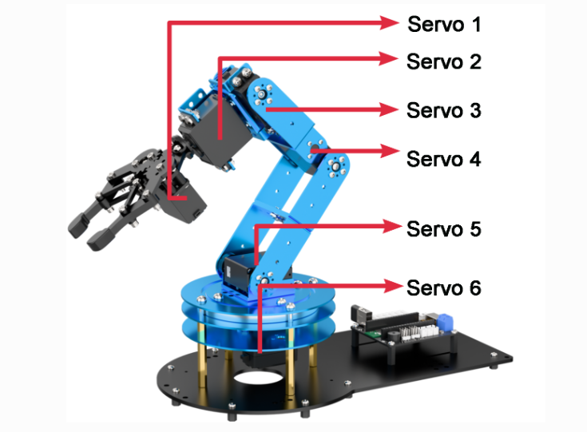
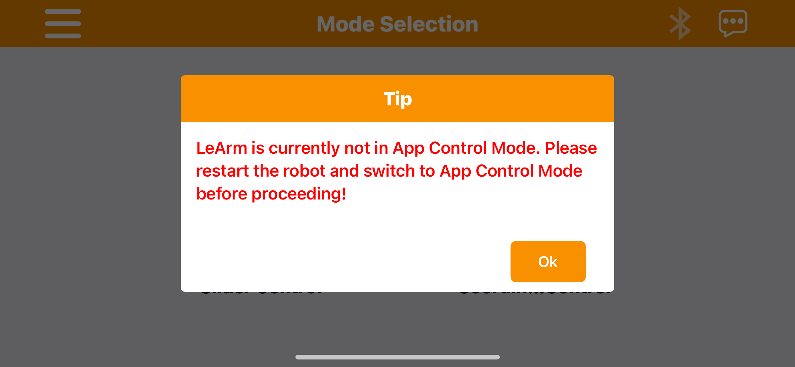

# HiWonder LeArm Open Source Effort



This GitHub repository is my personal attempt to get the **HiWonder LeArm Robotic Arm Kit (6DOF) Open Source** working after purchase.  

- **Product link:** [HiWonder LeArm on Amazon](https://www.amazon.com/dp/B0FJFVV6C7?ref=ppx_yo2ov_dt_b_fed_asin_title&th=1)  
- **Official Wiki:** [HiWonder LeArm Wiki](https://wiki.hiwonder.com/projects/LeArm_AI/en/latest/docs/1.Geting_Ready.html)  
- **Additional Docs (Google Drive):** [Google Repo](https://drive.google.com/drive/folders/1vwAXIoUjviLJAhGvHmiILseAW0N5tj59)
- **Factory Firmware (Google Drive):** [Google Repo](https://drive.google.com/drive/folders/1JufiqiCjYjH1hNJEh8xa6O496BbO982L)
- **Espressif ESP32 Board Manager URL:** [ESP32 Dev Module](https://espressif.github.io/arduino-esp32/package_esp32_index.json)


```

## Versions

Arduino IDE: 2.3.6
ESP32 by Espressif Systems: 3.3.2

```
---

## Background

I purchased this kit to explore Arduino-based robotics and STEM projects. After carefully assembling it in a little over **4 hours** and triple-checking every step, I plugged it in annnnnnd **nothing worked**.  It was supposed to go to a home position, etc. 



- I tried the iPhone app, it told me “LeArm is currently not in app control mode. Please restart the robot and switch to app control mode before proceeding!”
- I tried the iPad app, it told me “LeArm is currently not in app control mode. Please restart the robot and switch to app control mode before proceeding!”
- I tried the Playstion 2 (PS2) Controller that came in the box, confirmed connection with solid green lights (according to documentation), but it totally ignored anything I pressed.
- I tried the LeArm.exe Windows Desktop app and same message as 1 and 2, the robot was not in a certain control mode. Please restart.
- I tried arduino, and keep getting different errors about the built in open source libraries not being found or using old function/variable references and the robot/Espressif ESP32-WROOM32D board being completely unresponsive.

I'm really trying to make a fun hobby robot project out of an imperfect product.
But it's getting frustrating.

This repo exists to document my efforts to make this kit functional and to gather fixes, improvements, and translations of Chinese resources to English.

---

## Logs and Compiler Fails on Arduino IDE

Through an enormous amount of trial and error, found that something is happening within the Windows Cache and Arduino IDE. Despite clearing all files, uninstalling, and reinstalling the IDE, the following error kept showing up.

- verified I had the right board & port selected
- verified I had the right libraries included in the script

```
C:\Users\TheKicker\AppData\Local\Temp\.arduinoIDE-unsaved2025101-26284-elnxva.8axvd\sketch\sketch.ino: In function 'void setup()': C:\Users\TheKicker\AppData\Local\Temp\.arduinoIDE-unsaved2025101-26284-elnxva.8axvd\sketch\sketch.ino:4:3: error: 'ledcSetup' was not declared in this scope     
        4 | ledcSetup(0, 1000, 8); 
          | ^~~~~~~~~ 
C:\Users\TheKicker\AppData\Local\Temp\.arduinoIDE-unsaved2025101-26284-elnxva.8axvd\sketch\sketch.ino:5:3: error: 'ledcAttachPin' was not declared in this scope; did you mean 'ledcAttach'? 
        5 | ledcAttachPin(2, 0); 
          | ^~~~~~~~~~~~~ 
          | ledcAttach exit status 1 

Compilation error: 'ledcSetup' was not declared in this scope
```

Since downloading [Arduino Cloud Agent](https://cloud.arduino.cc/download-agent/) and using the Arduino Cloud Editor, I've been able to push the same exact snippet of code to the board allowing a successful compile and upload of the LED SOS INO script.  Additionally, I was able to play a simple melody using the controller board buzzer.

We're getting closer ya'll.

---

## Repository Structure (explanation of files)

```
hiwonder-learm-open-source/
├── LeArm-ESP32-Factory-Firmware/   # Factory Firmware via Customer Support
├── led-lights/                     # Code for controlling the LEDs on ESP32
├── libraries/                      # Arduino libraries needed for the arm as I add them
├── README.md                       # This file
└── reference-materials/            # PDFs, 3D models, and electrical drawings
    ├── 3d-models/                  # Not all models included (Github size limit)
    ├── electrical-drawings/
    │   ├── CHINESE-SCH-*.pdf
    │   └── ENGLISH-SCH-*.pdf       # Did my best to translate
    ├── A00-build-instructions.pdf  # Original build instructions 
    ├── A01-introduction.pdf
    ├── A02-controller.pdf
    ├── A03-deviation.pdf
    ├── controller-board.png    # Hi-Definition image For referencing pins
    ├── ESP32.png               # Hi-Definition image For referencing ESP32 Board
    └── servos.png              # Hi-Definition image For referencing servos
```

**Electrical Drawings:**  
I’ve done my best to translate the original Chinese schematics into English to make troubleshooting possible.  

- `CHINESE-SCH-*.pdf` — Original schematics in Chinese  
- `ENGLISH-SCH-*.pdf` — My translated versions  

---

## Goal

The primary goal of this repo is:

- To **get the HiWonder LeArm kit working** by any means necessary.  
- To **translate Chinese documentation** for better accessibility.  
- To create a **community-driven open source effort** for fixes and improvements.  

Contributions are welcome! If you have experience with Arduino, robotics, or can improve translations, please submit a PR.

---

## Notes / Current Status / Learnings

- Kit assembled successfully, all servos and mechanical parts physically installed according to instructions. 
- The kit is mechanically sound, well crafted aluminum parts and heavy base.
- Electronics are all connected according to documentation, but initial tests produce **no response** whatsoever.  
- Documentation and reference material collected for troubleshooting, unfortunately a lot of it is in Chinese which I don't speak.  
- Open to experimenting with code, firmware, and Arduino examples.
- There is some funny business between the Windows caching system and Arduino IDE. Do not use it. Download the Arduino Cloud Agent and use the Arduino Cloud Editor.
- I have found that GPIO Port 27 will make the buzzer work.
- I have found I can make the LED on the ESP32 board work (LED SOS code included above with a reference to the RMS Titanic)  

---

## References

- [HiWonder Official Wiki](https://wiki.hiwonder.com/projects/LeArm_AI/en/latest/docs/1.Geting_Ready.html)  
- [Google Drive Reference Materials](https://drive.google.com/drive/folders/1vwAXIoUjviLJAhGvHmiILseAW0N5tj59?usp=drive_link)  

---

## How to Help

1. Fork this repo.  
2. Test Arduino sketches with your own LeArm kit.  
3. Translate additional Chinese resources if possible.  
4. Submit PRs with fixes, sketches, or documentation improvements.  
5. Report bugs or issues in GitHub Issues.

---

---

**Disclaimer:** This project is experimental. I am doing my best to make a functional robotic arm out of what was initially a non-working purchase. Use at your own risk.  

---

*PS: I’m determined to make this kit work, one step at a time.*

