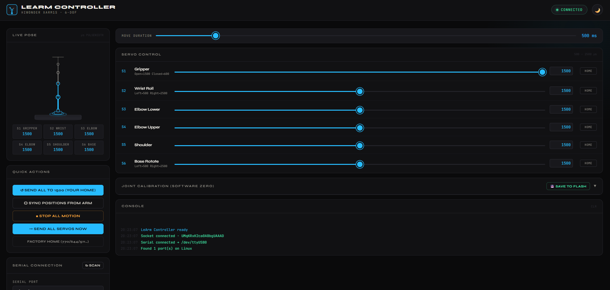
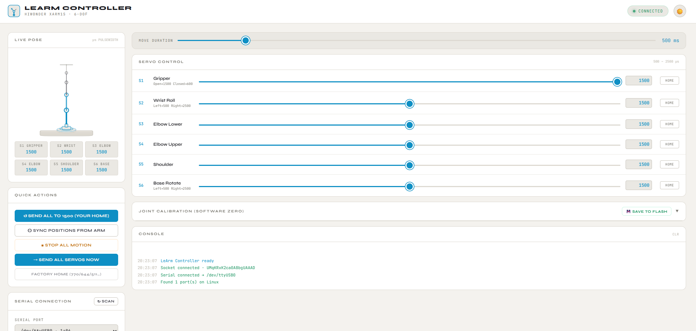
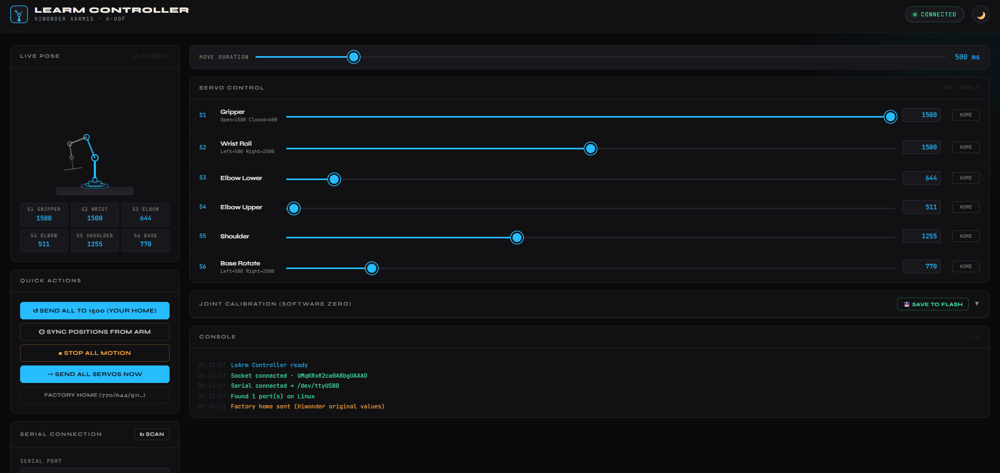

# LeArm Web Controller

Web-based GUI to control the **Hiwonder LeArm / xArm1S** (6-DOF) over USB serial.
Works on **Windows**, **macOS**, and **Linux/Raspberry Pi**.





---

## Hardware Setup

1. **Power on the arm** via USB-C (or battery)
2. **Connect USB** from your computer to the arm's controller board
3. **Switch to PC mode** — press the button on the controller board **once** after power-on  
   → LED blinks slowly (1 second on / 1 second off) = PC mode confirmed

---

## Software Setup

### Prerequisites — Node.js

Install Node.js 18+ from https://nodejs.org if you don't have it.

```bash
node --version   # should be v18 or higher
```

### Install & run

```bash
cd learm-controller
npm install
npm start
```

Then open a browser to **http://localhost:3000**

---

## Serial Port

The server auto-detects your platform and picks a default:

| Platform | Default |
|---|---|
| Windows | `COM6` |
| macOS | `/dev/tty.usbserial-0001` |
| Linux / Pi | `/dev/ttyUSB0` |

The UI **auto-scans** for available ports on load and sorts them — the arm's
CH340/CP210x chip usually appears first. Just hit **+ Connect**.

### Override the default

```bash
# Windows
set SERIAL_PATH=COM3 && npm start

# macOS / Linux
SERIAL_PATH=/dev/ttyUSB1 npm start
```

### Linux serial permissions (one-time)

```bash
sudo usermod -a -G dialout $USER
# Log out and back in
```

### Finding your port

**Windows** — Device Manager → Ports (COM & LPT) → look for "USB-SERIAL CH340"  
**macOS** — `ls /dev/tty.usb*` in Terminal  
**Linux** — `ls /dev/ttyUSB*` or `dmesg | tail` after plugging in  

---

## Project Structure

```
learm-controller/
├── src/
│   ├── server.js     — Express + Socket.IO, serial comms
│   └── protocol.js   — Packet builder/parser (from firmware source)
├── public/
│   └── index.html    — Web GUI (single file, no build step)
├── package.json
└── README.md
```

---



Live Pose is still a work in progress, doesn't always match reality - especially need to add logic for the EOAT. Right now the claw is represented by a single line.

## Servo ID → Joint Mapping

Confirmed from firmware source (`Pwmservo.cpp` + `knot_run()`):

| ID | Joint | Range | Notes |
|---|---|---|---|
| S1 | Gripper | 600–1500 µs | Open=1500, Closed=600 |
| S2 | Wrist Roll | 500–2500 µs | |
| S3 | Elbow Lower | 500–2500 µs | |
| S4 | Elbow Upper | 500–2500 µs | |
| S5 | Shoulder | 500–2500 µs | |
| S6 | Base Rotate | 500–2500 µs | Left=500, Right=2500 |

Baud rate: **9600** (confirmed from `Serial.begin(9600)` in firmware)

---

## Dev mode (auto-restart on file changes)

```bash
npm run dev
```
